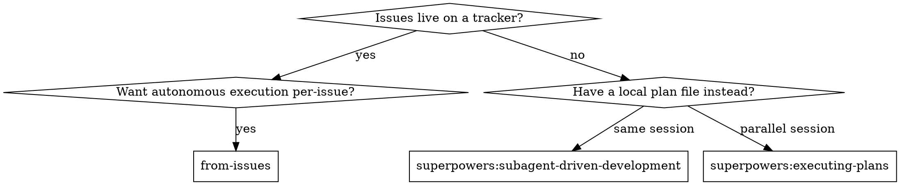
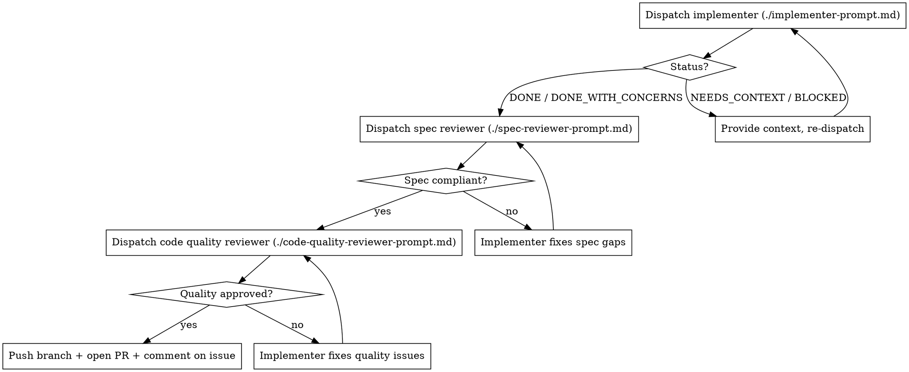

# From Issues

Execute work that lives on the issue tracker, one issue at a time, with subagent-driven implementation and review. Wraps the per-task discipline of `superpowers:subagent-driven-development` (fresh implementer + two-stage review) and adds the missing pieces for issue-tracker-resident workflows: blocker-aware DAG sequencing, triage gating, HITL checkpoints, per-issue branches and PRs, and review summaries posted as issue comments.

## When to use

**Use this skill when:**
- The work to do is on an issue tracker (GitHub / Gitea / GitLab / local-markdown).
- Issues have already been broken into vertical slices via `to-issues` (or equivalent) and triaged.
- You want continuous, autonomous execution of one or more ready issues.

**Don't use this skill for:**
- Issues still labeled `needs-triage` — run `triage` first.
- Issues not yet broken into slices — run `to-prd` then `to-issues` first.
- One-off tasks where there is no parent issue or PRD.
- Pure architecture / design work — that's an HITL discussion, not an executable issue.

## Inputs

The user invokes this skill via slash command. Recognized argument forms:

- **No argument** → pick the next ready issue automatically (see "Picking an issue" below).
- **`#N` or `N`** → target a specific issue by number. Skill still verifies it's ready (or HITL-gates).
- **`--parallel K`** → fan out: pick up to K independent ready issues and run them concurrently in separate worktrees. K defaults to 1 (no parallelism).
- **`--include-hitl`** → don't halt on HITL-tagged issues; brief the user inline and proceed.
- **`--dry-run`** → list what would be done, change nothing.

## Process

### 1. Discover issue tracker

The skill must know how to read and write issues. Check, in order:

1. `AGENTS.md` or `CLAUDE.md` at repo root for an `## Agent skills` block describing the tracker.
2. `docs/agents/issue-tracker.md` if it exists.
3. Heuristics if no config:
   - `tools/gitea-issue.js` present → Gitea via this CLI (the starshipviewer convention).
   - `gh` CLI available + `git remote` points at GitHub → GitHub.
   - `glab` CLI available + remote points at GitLab → GitLab.
   - `.scratch/` directory present with markdown issues → local-markdown convention.
4. If none of the above, ask the user which tracker to use and offer to run `setup-matt-pocock-skills`.

Detail and per-tracker commands: see `references/issue-tracker-adapters.md`.

### 2. Build the ready set

Fetch open issues. For each:

- **Skip** if labeled `needs-triage` (or whatever the project's "not yet triaged" label is) — but see "Inline triage offer" below before giving up.
- **Skip** if any blocker referenced in the `## Blocked by` section is still open.
- **Flag as HITL** if labeled `ready-for-human` (or the project's HITL convention) — design checkpoint required.
- **Mark ready** if labeled `ready-for-agent`.

Parse each issue body to extract: parent reference, "What to build" section, acceptance criteria checklist (`- [ ]` lines), blocked-by issue numbers.

#### Inline triage offer

If the only thing standing between the user and a ready set is `needs-triage` issues that share a parent PRD with comprehensive acceptance criteria (i.e. they were authored by `to-issues` from a settled PRD), don't just bail to the user with "run /triage first." Instead:

1. Detect the case: `needs-triage` issues whose `## Parent` references the same PRD, with non-empty acceptance criteria sections, authored by AI (commonly indicated in the body or via the AI-disclaimer line).
2. Offer to **inline-triage them now**, summarizing the proposed category (`enhancement` for to-issues output, `bug` if the parent is a bug report) and proposed state per issue (`ready-for-agent` by default; `ready-for-human` when the issue body or the parent PRD flagged it as HITL / contained design-judgment language).
3. On user approval, invoke the canonical `triage` skill's auto-create-labels routine (see triage SKILL.md "Auto-create missing labels"), apply the labels, and proceed to step 3 of from-issues.
4. If the user declines, fall back to the original "run /triage first" guidance and stop.

This avoids the trap where the same conversation just produced a clean PRD + sliced issues but `from-issues` refuses to start because the label state hasn't been hand-crank moved.

### 3. Pick the issue(s)

If the user passed `#N`, target it (and verify ready / HITL-gate). Otherwise, from the ready set, pick:

- The oldest issue that has no blockers, **or** whose blockers are all closed.
- Tie-break by smallest issue number (deterministic).
- If `--parallel K`: pick up to K issues such that no pair shares overlapping touched-file areas (best-effort heuristic from acceptance criteria text). When in doubt, fewer in parallel is safer — single-implementer SDD discipline still applies per issue.

If nothing is ready, report the unblocked-but-not-triaged set and the blocked set, then stop.

### 4. HITL gate

For HITL issues, halt before dispatching the implementer. Present:

- Issue title and number
- "What to build" summary (1–2 sentences)
- The acceptance criteria as a list
- A specific question: "Approve dispatch as-is, refine the spec first, or skip?"

Resume only on explicit approval. If `--include-hitl` was passed, skip the halt — but still print the brief so the user sees what's about to start.

### 5. Set up workspace per issue

For each issue being executed:

1. Pick a branch name: `feat/issue-<N>-<slug>` where slug is a kebab-case of the title (truncated to ~40 chars).
2. If running in parallel (K > 1), create a git worktree at `../<repo>-issue-<N>/` checked out to the new branch. If serial, just check out the new branch in the main worktree.
3. Verify the branch isn't already in use.

Use the same conventions as `superpowers:using-git-worktrees` if available.

### 6. Per-issue execution loop

Mirror SDD's three-stage flow, populated from the issue body rather than from a plan file:

Prompt templates at `./implementer-prompt.md`, `./spec-reviewer-prompt.md`, `./code-quality-reviewer-prompt.md`. They are pre-adapted for issue-as-spec input.

The four implementer statuses (`DONE`, `DONE_WITH_CONCERNS`, `NEEDS_CONTEXT`, `BLOCKED`) are handled exactly as SDD specifies.

### 7. Close the loop on the tracker

Once code-quality review passes:

1. Push the branch.
2. Open a PR (or merge request) referencing the issue. PR title = issue title. PR body summarizes what changed and links the issue (e.g. "Closes #N" if the tracker supports auto-close).
3. Post a comment on the issue with: spec-review summary, code-quality-review summary, link to the PR, branch name. (See `references/issue-tracker-adapters.md` for the per-tracker comment commands.)
4. **Do not close or modify the issue itself** — the PR merge handles closure (or the user closes it manually). This skill never destructively edits the parent issue.

### 8. Continue or stop

If the user invoked with no specific issue:

- After completing one issue, re-evaluate the ready set (a freshly-merged issue may have unblocked others) and continue.
- If `--parallel K`, kick off the next batch up to K.
- Stop when the ready set is empty, when all remaining ready issues are HITL and the user hasn't passed `--include-hitl`, or when the user explicitly halts.

If the user passed `#N`, stop after that one issue completes (or fails / is gated).

## Model selection

Inherit SDD's guidance:

- **Mechanical implementation tasks** (one or two files, clear acceptance criteria) → fast/cheap model.
- **Multi-file integration** → standard model.
- **Architecture / design / review** → most capable model.

The skill's controller (the model running this skill) chooses the model per implementer/reviewer dispatch based on the issue's complexity. Acceptance-criteria count, file scope hints in "What to build", and the HITL flag are signals.

## Red flags

**Never:**
- Start work on an issue still labeled `needs-triage`.
- Start work on an issue with open blockers.
- Skip either review (spec compliance OR code quality).
- Dispatch parallel implementers in the **same** worktree.
- Modify or close the parent issue (PRD).
- Force-merge a PR that fails a review.
- Skip the HITL gate when an issue is HITL-flagged unless the user passed `--include-hitl`.

**If the implementer asks questions:** answer with full context (the issue body, parent PRD, surrounding code if needed) — don't hand-wave.

**If a reviewer finds issues:** the same implementer subagent fixes them, then the reviewer reviews again. Repeat until clean. Don't accept partial fixes.

**If an issue is fundamentally wrong** (acceptance criteria conflict, scope ambiguity that resists clarification): stop, post a comment on the issue describing what's wrong, and surface it to the user. Don't paper over it.

## Bundled references

- `./implementer-prompt.md` — implementer subagent prompt, populated from issue body.
- `./spec-reviewer-prompt.md` — spec-compliance review prompt, populated from acceptance criteria.
- `./code-quality-reviewer-prompt.md` — code quality review prompt, dispatched after spec review passes.
- `references/issue-tracker-adapters.md` — per-tracker commands (Gitea / GitHub / GitLab / local-markdown) for fetching, commenting, and PR creation.
- `references/orchestration.md` — DAG sequencing details, parallelism heuristics, HITL workflow, failure recovery.

## Integration with related skills

- **superpowers:subagent-driven-development** — this skill borrows its review discipline; if you have a local plan file instead of issue-tracker tickets, use SDD directly.
- **superpowers:using-git-worktrees** — for parallel execution, use this skill's worktree creation conventions.
- **superpowers:test-driven-development** — implementer subagents are reminded to use TDD per task.
- **superpowers:requesting-code-review** — code-quality reviewer subagent inherits the standard review template.
- **superpowers:finishing-a-development-branch** — invoke after the last issue lands if you want a coordinated branch wrap-up.
- **to-issues** / **to-prd** — produce the issues this skill consumes.
- **triage** — run before this skill for any new `needs-triage` issues.
