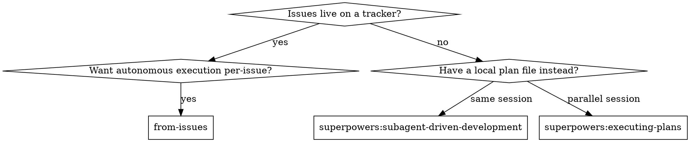
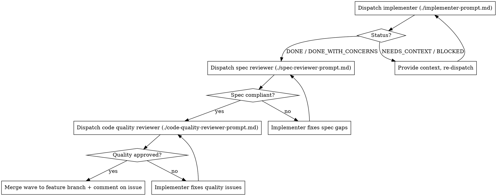

# From Issues

Execute work that lives on the issue tracker, one issue at a time, with subagent-driven implementation and review. Wraps the per-task discipline of `superpowers:subagent-driven-development` (fresh implementer + two-stage review) and adds the missing pieces for issue-tracker-resident workflows: blocker-aware DAG sequencing, triage gating, HITL checkpoints, per-issue branches and PRs, and review summaries posted as issue comments.

## When to use



**Use this skill when:**
- The work to do is on an issue tracker (GitHub / Gitea / GitLab / local-markdown).
- Issues have already been broken into vertical slices via `to-issues` (or equivalent) and triaged.
- You want continuous, autonomous execution of one or more ready issues.

**Don't use this skill for:**
- Issues still labeled `needs-triage` — run `triage` first.
- Issues not yet broken into slices — run `to-prd` then `to-issues` first.
- One-off tasks where there is no parent issue or PRD.
- Pure architecture / design work — that's an HITL discussion, not an executable issue.

## Inputs

The user invokes this skill via slash command. Recognized argument forms:

- **No argument** → pick the next ready issue automatically (see "Picking an issue" below).
- **`#N` or `N`** → target a specific issue by number. Skill still verifies it's ready (or HITL-gates).
- **`--parallel K`** → fan out: pick up to K independent ready issues and run them concurrently in separate worktrees. K defaults to 1 (no parallelism).
- **`--include-hitl`** → don't halt on HITL-tagged issues; brief the user inline and proceed.
- **`--dry-run`** → list what would be done, change nothing.

## Process

### 1. Discover issue tracker

The skill must know how to read and write issues. Check, in order:

1. `AGENTS.md` or `CLAUDE.md` at repo root for an `## Agent skills` block describing the tracker.
2. `docs/agents/issue-tracker.md` if it exists.
3. Heuristics if no config:
   - `tools/gitea-issue.js` present → Gitea via this CLI (the starshipviewer convention).
   - `gh` CLI available + `git remote` points at GitHub → GitHub.
   - `glab` CLI available + remote points at GitLab → GitLab.
   - `.scratch/` directory present with markdown issues → local-markdown convention.
4. If none of the above, ask the user which tracker to use and offer to run `setup-matt-pocock-skills`.

Detail and per-tracker commands: see `references/issue-tracker-adapters.md`.

### 2. Build the ready set

Fetch open issues. For each:

- **Skip** if labeled `needs-triage` (or whatever the project's "not yet triaged" label is) — but see "Inline triage offer" below before giving up.
- **Skip** if any blocker referenced in the `## Blocked by` section is still open.
- **Flag as HITL** if labeled `ready-for-human` (or the project's HITL convention) — design checkpoint required.
- **Mark ready** if labeled `ready-for-agent`.

Parse each issue body to extract: parent reference, "What to build" section, acceptance criteria checklist (`- [ ]` lines), blocked-by issue numbers.

#### Inline triage offer

If the only thing standing between the user and a ready set is `needs-triage` issues that share a parent PRD with comprehensive acceptance criteria (i.e. they were authored by `to-issues` from a settled PRD), don't just bail to the user with "run /triage first." Instead:

1. Detect the case: `needs-triage` issues whose `## Parent` references the same PRD, with non-empty acceptance criteria sections, authored by AI (commonly indicated in the body or via the AI-disclaimer line).
2. Offer to **inline-triage them now**, summarizing the proposed category (`enhancement` for to-issues output, `bug` if the parent is a bug report) and proposed state per issue (`ready-for-agent` by default; `ready-for-human` when the issue body or the parent PRD flagged it as HITL / contained design-judgment language).
3. On user approval, invoke the canonical `triage` skill's auto-create-labels routine (see triage SKILL.md "Auto-create missing labels"), apply the labels, and proceed to step 3 of from-issues.
4. If the user declines, fall back to the original "run /triage first" guidance and stop.

This avoids the trap where the same conversation just produced a clean PRD + sliced issues but `from-issues` refuses to start because the label state hasn't been hand-crank moved.

### 3. Pick the issue(s)

If the user passed `#N`, target it (and verify ready / HITL-gate). Otherwise, from the ready set, pick:

- The oldest issue that has no blockers, **or** whose blockers are all closed.
- Tie-break by smallest issue number (deterministic).
- If `--parallel K`: pick up to K issues such that no pair shares overlapping touched-file areas (best-effort heuristic from acceptance criteria text). When in doubt, fewer in parallel is safer — single-implementer SDD discipline still applies per issue.

If nothing is ready, report the unblocked-but-not-triaged set and the blocked set, then stop.

### 4. HITL gate

For HITL issues, halt before dispatching the implementer. Present:

- Issue title and number
- "What to build" summary (1–2 sentences)
- The acceptance criteria as a list
- A specific question: "Approve dispatch as-is, refine the spec first, or skip?"

Resume only on explicit approval. If `--include-hitl` was passed, skip the halt — but still print the brief so the user sees what's about to start.

### 5. Set up workspace — wave-based execution

The skill executes a feature as a series of **waves**. A wave is a set of issues that can run concurrently because they don't touch the same code. Most waves are size 1 (sequential). Parallel waves are the exception, used only when independence is clear.

```
                    feature branch (canonical)
   ─── slice #13 ──────┬──── slice #16 ──── slice #18 ──── slice #19 ───►
                       │                       ▲                ▲
        wave of 1      │   wave of 2:          │  wave of 1     │
                       └── worktree-A (#16) ───┘                │
                       └── worktree-B (#17) ───┘                │
                                                                │
                                                          tip = unified
                                                          state, ready
                                                          for user test
```

#### Feature branch is the integration point

Pick a branch name: `feat/<feature-slug>` derived from the parent PRD's title. Verify the branch isn't already in use, then create it from the user's current branch (the "base"). All slice commits land on this branch, tagged `<type>: [#N] <subject>`.

The feature branch **tip** is the unified state. The skill ends there. The user tests, approves, and only then merges down to the base. The skill does **not** open a PR or merge to base autonomously.

#### Worktree policy (read this before dispatching anything)

A worktree is a duplicate checkout (gigabytes of disk on this repo). Spin one up **only** to let two or more agents write the filesystem **at the same time**. Never as a default isolation mechanism per agent.

| Situation | Workspace |
|---|---|
| Sequential issue (wave size = 1) | Main worktree, on the feature branch. **No spinoff.** |
| Parallel wave size K ≥ 2 on the same feature | K-1 throwaway worktrees + main worktree, all branched from the feature branch tip |
| Spec / quality reviewer for a slice | Same worktree the implementer used — readers don't need their own worktree |
| Merge / wave-finalize step | Main worktree only |

**Anti-pattern that triggered this rewrite:** invoking the Agent tool with `isolation: "worktree"` for every dispatched agent, including sequential implementers and reviewers. That produces N worktrees for N agents and never merges them, leaving the canonical branch empty. Don't do this. Pass `isolation` only when the wave is genuinely parallel and the agent is one of the K concurrent implementers.

#### Wave execution loop

For each wave:

1. **Plan the wave.** From the ready set, pick either one issue (sequential) or up to K independent issues (parallel; see independence heuristic in `references/orchestration.md`). When in doubt, prefer sequential.
2. **Set up worktrees** (parallel waves only). Create K-1 throwaway worktrees at `../<repo>-wave-<N>-<slug>/`, each checked out on the feature branch at the current tip. The main worktree handles the K-th issue.
3. **Dispatch implementers in one message** when parallel — multiple Agent tool calls in a single response, per `superpowers:dispatching-parallel-agents`. Sequential = one Agent call.
4. **Per-slice review loop** runs in the same worktree the implementer wrote in (spec reviewer → fixes → quality reviewer → fixes). Don't merge until both reviews pass.
5. **Merge the wave back to the feature branch.** The controller (this skill) does the merge directly in the main worktree:
   - Fast-forward where possible (single-issue waves, or worktrees with disjoint files).
   - Plain merge with `--no-ff` if you want a wave-boundary marker, but FF is fine.
   - **On real conflict**: stop and either resolve in the controller (small conflicts) or dispatch a merge subagent with the conflicting hunks as context (large conflicts). Don't paper over conflicts.
6. **Remove throwaway worktrees** with `git worktree remove` once their commits are on the feature branch. Don't accumulate them across waves.
7. **Integration sanity pass** after merge: a quick re-run of the test suite (or a focused subset for the touched areas) on the merged feature branch tip. The per-slice reviews already vetted each slice in isolation; this catches cross-slice regressions only.
8. **Recompute the ready set** and start the next wave, or finalize.

#### When to use branch-per-issue (override)

Branch-per-issue + one-PR-per-issue is the right shape only when issues are **genuinely independent** features or bug fixes, with no shared schema or modules. Heuristic: if any two issues touch the same source file non-trivially, they belong on the same feature branch.

If the user explicitly asks for one PR per issue, honour it — but warn if the slices share infrastructure.

### 6. Per-issue execution loop

Mirror SDD's three-stage flow, populated from the issue body rather than from a plan file:



Prompt templates at `./implementer-prompt.md`, `./spec-reviewer-prompt.md`, `./code-quality-reviewer-prompt.md`. They are pre-adapted for issue-as-spec input.

The four implementer statuses (`DONE`, `DONE_WITH_CONCERNS`, `NEEDS_CONTEXT`, `BLOCKED`) are handled exactly as SDD specifies.

### 7. Close the loop on the tracker

#### After each slice's wave merges into the feature branch

1. Slice commits on the feature branch must be tagged `<type>: [#N] <subject>` so the tracker picks up the cross-link.
2. Push the feature branch (plain push; force-push only if you intentionally rebased).
3. Post a comment on the issue with: spec-review summary, code-quality-review summary, the commit range that landed it (`abc123..def456` on `feat/<feature>`), and the feature branch name. (See `references/issue-tracker-adapters.md`.)
4. **Do not open a PR.** Slices keep accumulating on the feature branch. The skill's terminal state is the feature branch tip — not a PR.
5. **Do not close or modify the issue itself.** Auto-close happens when the user eventually merges the feature branch to base.

#### After the final slice — stop, don't merge

Once every slice has landed on the feature branch and the integration sanity pass is clean:

1. Stop. Print a one-screen summary: feature branch name, tip SHA, list of issues with their commit ranges, what the user should test.
2. Hand control back to the user with a clear "ready for testing" prompt. Do **not** open a PR, do **not** merge to base, do **not** push to a special integration remote — wait for the user to test and decide.
3. The user's verification is the final HITL gate. Once they approve, they (or you, on their explicit instruction) merge the feature branch to the base they branched from.

#### When the user wants per-issue PRs (override)

If the user explicitly asks for one PR per issue, honour it. Branch-per-issue is the workspace shape and a rolling integration branch keeps merges sane. Only do this when asked — it's substantially more user-side work for cohesive features.

### 8. Continue or stop

If the user invoked with no specific issue:

- After each wave completes and merges back, re-evaluate the ready set (newly-merged work may unblock others) and start the next wave.
- Stop when the ready set is empty (feature branch is at unified tip — see "After the final slice").
- Stop when all remaining ready issues are HITL and the user hasn't passed `--include-hitl`.
- Stop when the user explicitly halts.

If the user passed `#N`, stop after that one issue completes (or fails / is gated).

### HITL — minimum-necessary policy

HITL halts cost the user attention. Use them only where they're load-bearing:

- **Before a HITL-flagged issue dispatches** — design judgment that wasn't resolvable during triage / brainstorming.
- **After a HITL-flagged issue's wave merges** — if the issue's nature is "human needs to verify something" (e.g. visual / UX), surface the result and wait.
- **At the very end**, before handing the feature branch tip back for user testing.

Do **not** halt between non-HITL waves. Do **not** halt for routine progress checkpoints. Implementation-relevant questions should already be answered by the issue body and parent PRD; if they're not, the issue wasn't ready and the skill shouldn't have started it.

## Model selection

Inherit SDD's guidance:

- **Mechanical implementation tasks** (one or two files, clear acceptance criteria) → fast/cheap model.
- **Multi-file integration** → standard model.
- **Architecture / design / review** → most capable model.

The skill's controller (the model running this skill) chooses the model per implementer/reviewer dispatch based on the issue's complexity. Acceptance-criteria count, file scope hints in "What to build", and the HITL flag are signals.

## Red flags

**Never:**
- Start work on an issue still labeled `needs-triage`.
- Start work on an issue with open blockers.
- Skip either review (spec compliance OR code quality).
- Dispatch parallel implementers in the **same** worktree.
- Modify or close the parent issue (PRD).
- Force-merge a PR that fails a review.
- **Create a worktree per dispatched agent.** Worktrees exist to parallelize concurrent writers, not to isolate every Agent call. Sequential implementers and all reviewers run in the existing worktree. Never pass `isolation: "worktree"` to the Agent tool as a default — only for the K concurrent implementers in a parallel wave.
- **End a wave without merging the worktrees back to the feature branch.** Worktrees are throwaway scratch space; the canonical state lives on the feature branch. If you finish a wave and the feature branch tip hasn't moved, you forgot to merge.
- Branch every issue off `main` when issues depend on each other's work — the final integration becomes an n-way merge with conflicts in every shared file. Use one feature branch for all slices of one feature.
- Open one PR per issue when the issues are slices of a cohesive feature.
- **Open a PR or merge to base autonomously at the end of a run.** The skill ends at the feature branch tip and surfaces it to the user. The user tests and decides.
- Halt for HITL between routine non-HITL waves. HITL halts are for HITL-flagged issues and the final user-test handoff only.

**If the implementer asks questions:** answer with full context (the issue body, parent PRD, surrounding code if needed) — don't hand-wave.

**If a reviewer finds issues:** the same implementer subagent fixes them, then the reviewer reviews again. Repeat until clean. Don't accept partial fixes.

**If an issue is fundamentally wrong** (acceptance criteria conflict, scope ambiguity that resists clarification): stop, post a comment on the issue describing what's wrong, and surface it to the user. Don't paper over it.

## Bundled references

- `./implementer-prompt.md` — implementer subagent prompt, populated from issue body.
- `./spec-reviewer-prompt.md` — spec-compliance review prompt, populated from acceptance criteria.
- `./code-quality-reviewer-prompt.md` — code quality review prompt, dispatched after spec review passes.
- `references/issue-tracker-adapters.md` — per-tracker commands (Gitea / GitHub / GitLab / local-markdown) for fetching, commenting, and PR creation.
- `references/orchestration.md` — DAG sequencing details, parallelism heuristics, HITL workflow, failure recovery.

## Integration with related skills

- **superpowers:subagent-driven-development** — this skill borrows its review discipline; if you have a local plan file instead of issue-tracker tickets, use SDD directly.
- **superpowers:using-git-worktrees** — for parallel execution, use this skill's worktree creation conventions.
- **superpowers:test-driven-development** — implementer subagents are reminded to use TDD per task.
- **superpowers:requesting-code-review** — code-quality reviewer subagent inherits the standard review template.
- **superpowers:finishing-a-development-branch** — invoke after the last issue lands if you want a coordinated branch wrap-up.
- **to-issues** / **to-prd** — produce the issues this skill consumes.
- **triage** — run before this skill for any new `needs-triage` issues.
